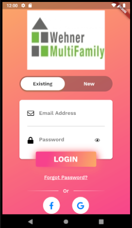
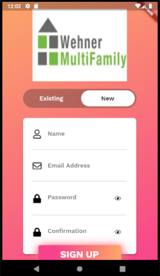
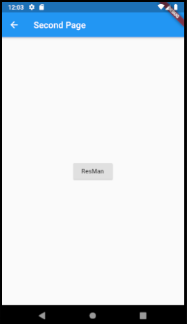
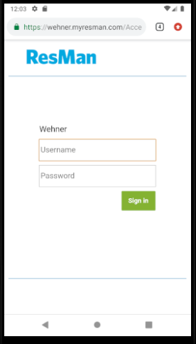

# wmf_flutter_app
A proof of concept for the WMF mobile app. 

The app is built on flutter, which can create the final app for both android and iOS. 

The app's functionalities include:
- A login screen for current users

- A sign up page for new users to create an account

- Once the user has logged in, he/she will be taken to the second page

- The second page will allow access to the property management website. 

